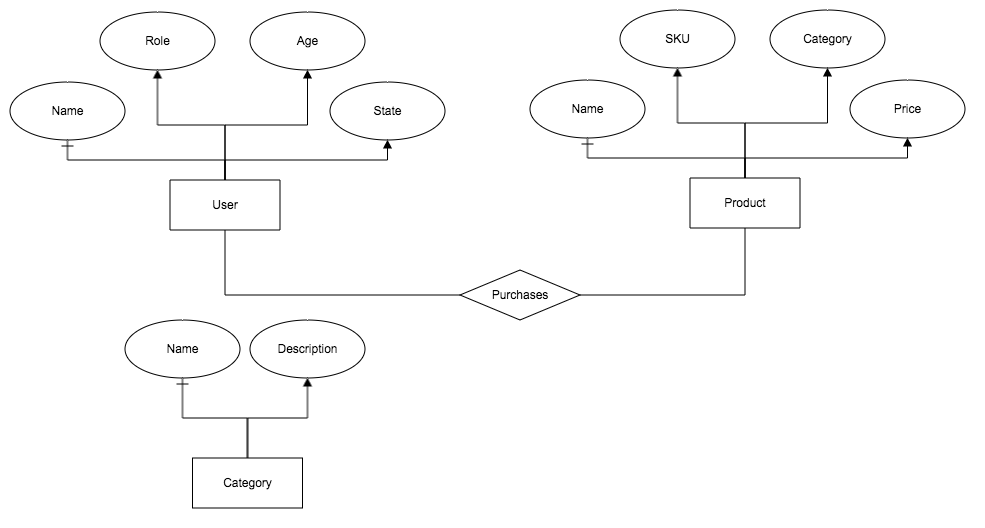
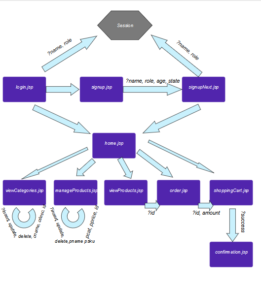

### CSE 135 Project 1
#### Tatsu

Project 1
Team: Tatsu
Arthur de Jesus
Mandeep Sran

##### Required Setup:
  * Create a database named "Tatsu" (note the capital T)
  * Run db.sql in your GUI of choice
  * We have the username and password set to postgres and postgres1 respectively
  * Make sure your eclipse project is name "135" to visit "localhost:8080/135"

##### Assumptions:

 * On the categories page, an owner can update or delete any category, regardless of who created the category.

 * The shopping cart is session-scoped and will not be remembered across multiple visits.

 * If the price changes between the time a user adds an item to the shopping cart and the time it is displayed on
  the cart, the displayed price will be the current (updated) price of the product.

* The user names and searches are both case sensitive.

##### Technology Used:

  * IDE: Eclipse Jave EE
  * Database: Postgres
  * Database GUI: pSequel
  * Design Toolkit: Bootstrap
  * Model: Model 1 Type
  * Server: Tomcat

